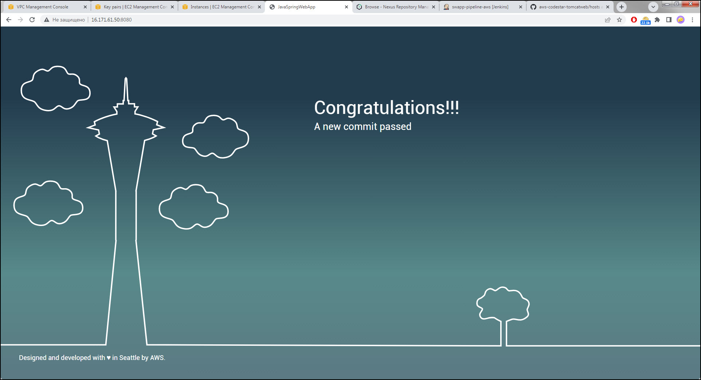

# Simple Web Application Continuous Delivery

## Motivation

It was supposed that the choosing of the task will introduce to complexities of deploying web applications using technology of containerization technology and configuration management tools

## Actuality

Using management tools and containers as computational agents with required dependencies for building/testing/deploying applications provides a scalable efficiency and offload of main manager server

## Main goal

Provide a automated release management  of java web application using Jenkins via conterization and Ansible for continuous delivery

## Tasks

- Configure CI pipeline on Jenkins host Container with Remote API
- Build [Docker image of Jenkins agent](https://hub.docker.com/repository/docker/kostkzn/jenkins-agent-maven-jdk11/general) & integrate it with Jenkins host
- Configure additional agent host with Ansible tool to Deploy application to Tomcat servlet
- Configure AWS hosts for migration to cloud setup

## Design

### Technology Stack
 
- Git – version control system
- Jenkins – continuous integration server
- Maven – build tool for java applications
- NEXUS – artifact repository with a cache of necessary dependencies on it
- Ansible – configuration for hosts stack and for job of delivery application to server
- Tomcat – server/webcontainer for java applications
- AWS – provides cloud computing

## Implementation

[AWS CodeStar](https://aws.amazon.com/codestar/) demo web application were taken for implementation with minor visual changes

The basic code of current project located on [https://github.com/kostkzn/aws-codestar-tomcatweb](https://github.com/kostkzn/aws-codestar-tomcatweb)

The code includes java testing instructions, Ansible [playbook](https://github.com/kostkzn/aws-codestar-tomcatweb/tree/main/ansible) for app deploying to Tomcat and [Jenkinsfile](https://github.com/kostkzn/aws-codestar-tomcatweb/blob/main/Jenkinsfile) for pipeline building

Another Ansible playbook of configuration for cloud hosts stack located [here](/ansible_inits/). The playbook isn't yet pumped to full automation but is really helps for quick setup of Tomcat and Docker environment

## Demo

Hosts stack on AWS:

Initial page of Tomcat after installing:

Jenkins pipeline:

First application deploy:

Some visual code changes triggers a second pipeline iteration

New deploy:

Saved artifacts on NEXUS repository

Also cashed dependencies for next build/testing iterations:

## Conclusions

There's always room for improvement. The next expert level is a single keyboard command to complete full CI/CD. and deep understanding of architectures

There is a need to delve into understanding application architectures, to understand the pros and cons
